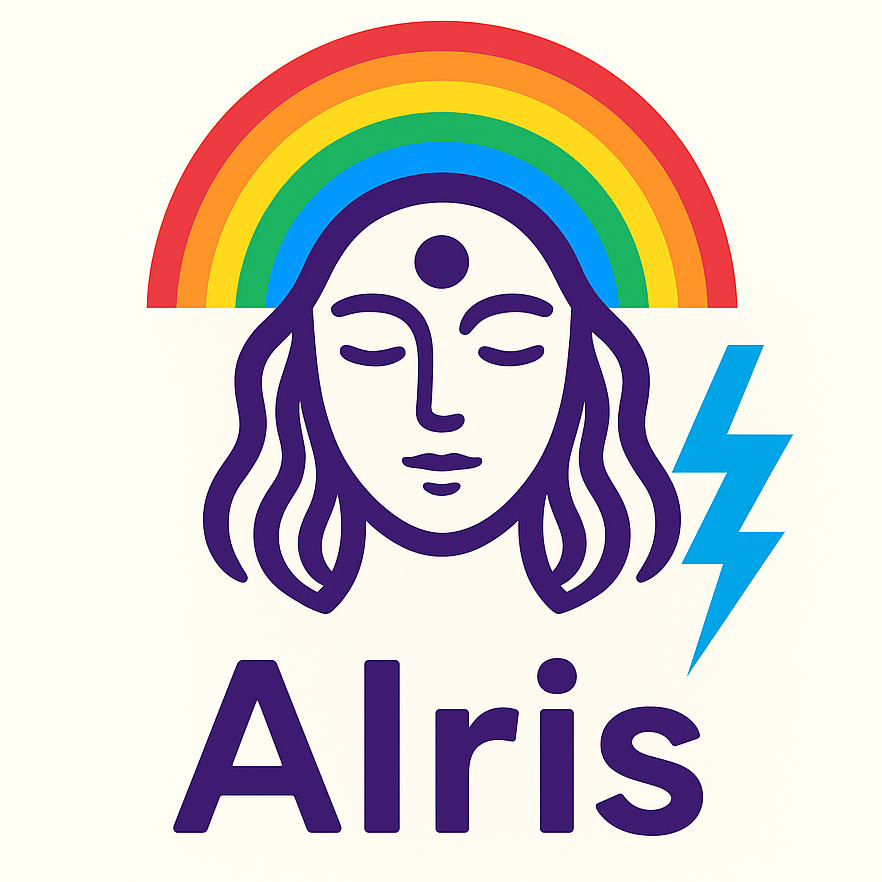

# AIris: Artificial Intelligence Request Insight System


[](https://codecov.io/gh/RyosukeDTomita/airis-burp-extensions)
[](https://github.com/RyosukeDTomita/airis-burp-extensions/actions/workflows/test-coverage.yml)
[](https://securityscorecards.dev/viewer/?uri=github.com/RyosukeDTomita/airis-burp-extensions)
[](https://github.com/RyosukeDTomita/airis-burp-extensions/actions/workflows/scorecard.yml)



## INDEX

- [ABOUT](#about)
- [HOW TO USE](#how-to-use)
- [ENVIRONMENT](#environment)
- [PREPARING](#preparing)
- [For Developers](#for-developers)

---

## ABOUT

This is an [Burp Suite](https://portswigger.net/burp) extension that allows you to **LLM custom API key and API endpoint**, and send the selected request and response from within Burp Suite as context for analysis by an LLM.

### Why AIris?

- [Burp AI](https://portswigger.net/burp/ai) is not supported in the free version of Burp Suite.
- Some companies only allow the use of organization-managed AI services, such as [Azure OpenAI](https://learn.microsoft.com/ja-jp/azure/ai-foundry/openai/overview), [Amazon Bedrock](https://aws.amazon.com/jp/bedrock/).

---

## HOW TO USE

1. Open Burp Suite and add .jar file.
    
2. Add Your OpenAI API Key in the Extension settings.
    
3. Use Extensions
    
4. Result
    

---

## ENVIRONMENT

This project is just Vibe Coding right now.
I'm improveing it little by little.

- Docker Image: gradle:9.0.0-jdk21-noble
- Java: 21
  - montoya-api: 2025.7
- Gradle: 9.0.0

---

## PREPARING

```shell
cd airis
./build.sh
```

---

## For Developers

### Format code

```shell
cd airis
./gradlew fmt
```

### Test code

```shell
cd airis
./gradlew test --tests <ClassName of Test.java>
# print debug
./gradlew test --tests <ClassName of Test.java> --info
# all test
./gradlew test
```
