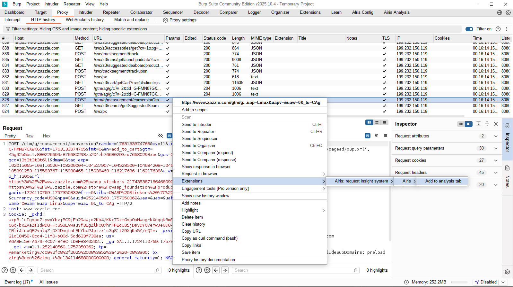
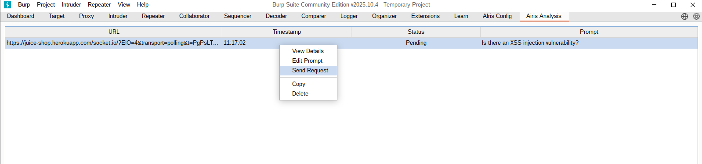
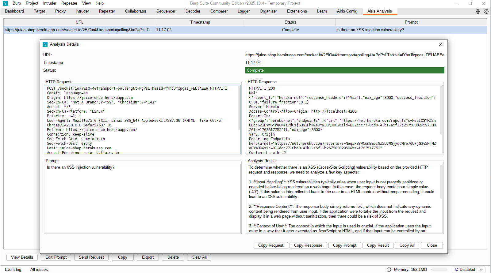
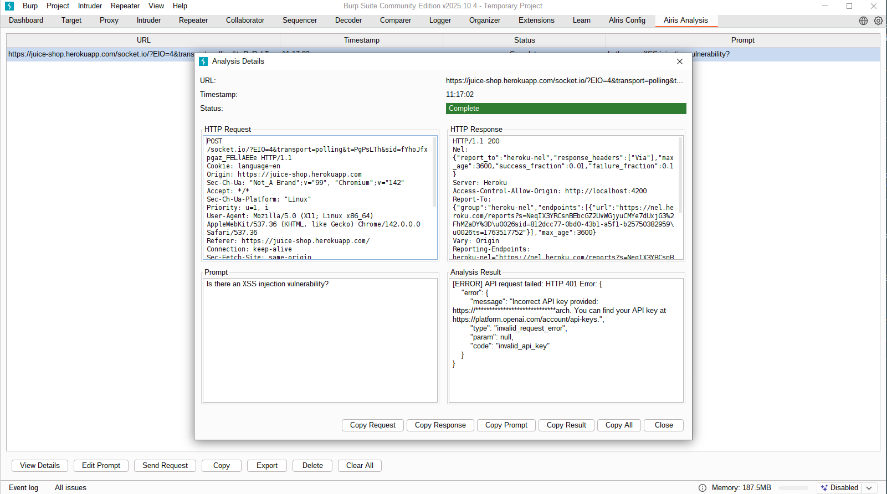
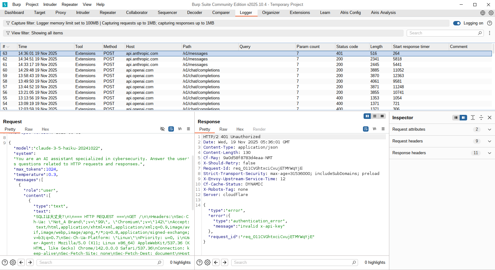

# AIris: Artificial Intelligence Request Insight System


[](https://github.com/RyosukeDTomita/airis-burp-extensions/actions/workflows/test-coverage.yml)
[](https://codecov.io/gh/RyosukeDTomita/airis-burp-extensions)
[](https://securityscorecards.dev/viewer/?uri=github.com/RyosukeDTomita/airis-burp-extensions)
[](https://github.com/RyosukeDTomita/airis-burp-extensions/actions/workflows/scorecard.yml)
[](https://github.com/RyosukeDTomita/airis-burp-extensions/actions/workflows/codeql.yml)


## INDEX

- [ABOUT](#about)
- [HOW TO USE](#how-to-use)
- [ENVIRONMENT](#environment)
- [For Developers](#for-developers)

---

## ABOUT

This is an [Burp Suite](https://portswigger.net/burp) extension that allows you to **LLM custom API key and API endpoint**, and send the selected request and response from within Burp Suite as context for analysis by an LLM.

### Why AIris?

- [Burp AI](https://portswigger.net/burp/ai) is not supported in the free version of Burp Suite.
- Some companies only allow the use of organization-managed AI services, such as [Azure OpenAI](https://learn.microsoft.com/ja-jp/azure/ai-foundry/openai/overview), [Amazon Bedrock](https://aws.amazon.com/jp/bedrock/).

### Not BApp Store Extension

> [!NOTE]
> This extension was not accepted into the BApp Store because it uses custom LLM not [Burp AI](https://portswigger.net/burp/ai). In detail,
[See this discussion](https://github.com/PortSwigger/extension-portal/issues/154#issuecomment-3633287871).

### Supported LLMs

- OpenAI
- Azure OpenAI
- Anthropic Claude
- (Planned) Amazon Bedrock Claude

---

## HOW TO USE

1. Open Burp Suite and add .jar file. You can download from [latet releases](https://github.com/RyosukeDTomita/airis-burp-extensions/releases) or build for yourself.
    
2. Move to `AIris Config` tab and put your API key, endpoint, and preferred model. Don't forget to push Save button.
    
3. Select Burp Suite's HTTP history tab, right-click on a request or response, and send to `AIris Analysis` tab then you can write your prompt.
    
    
4. Move to `AIris Analysis` tab right click on the request and push `Send Request` button. Then you can see the analysis result from LLM.
    
    

> [!NOTE]
> If you are unable to get satisfactory results, please check `Airis Analysis` tab result area or Logger tab(Built-in Burp Suite) for error messages.
> 
> 

### Using Azure Open AI

Replacing the endpoint will make it work.
Include the model name and version as shown below.

```
https://<your-resource-name>.openai.azure.com/openai/deployments/<deployment-name>/chat/completions?api-version=<api-version>
e.g. https://sigma-oai-westus.openai.azure.com/openai/deployments/gpt-40-mini/chat/completions?api-version=2024-02-15-preview
```

### Using Amazon Bedrock(Claude)

I'll test it soon.
Looking for volunteers to help verify functionality.

---

## ENVIRONMENT

This project is just Vibe Coding right now.
I'm improveing it little by little.

- Docker Image: gradle:9.0.0-jdk21-noble
- Java: 21
  - montoya-api: 2025.7
- Gradle: 9.0.0

---

## For Developers

### BUILD

```shell
cd airis
./build.sh
```

### Format code

```shell
cd airis
./gradlew fmt
```

### Test code

```shell
cd airis
./gradlew test --tests <ClassName of Test.java>
# print debug
./gradlew test --tests <ClassName of Test.java> --info
# all test
./gradlew test
```

---

## BApp Store acceptance criteria(self check)

This extension is designed to meet the security- and quality-related [acceptance criteria](https://portswigger.net/burp/documentation/desktop/extend-burp/extensions/creating/bapp-store-acceptance-criteria) required for the **BApp Store**:

### 1. It performs a unique function

Yes.
I could not find any other extension in BApp Store with a similar name.
Reference: [#Not BApp Store Extension](#not-bapp-store-extension)

### 2. It has a clear, descriptive name

Yes (I think so).

### 3. It operates securely

Yes

- API keys are masked when writing logs.
- API keys are stored in encrypted form.

### 4. It includes all dependencies

Yes.
All dependencies are managed via **Gradle** and shaded into a single `airis-burp.jar` during `./gradlew jar`, so BApp users need no additional installations. In detail: see [build.gradle.kts](./build.gradle.kts).

### 5. It uses threads to maintain responsiveness

Yes.
All the HTTP requests to external LLM services use threads and work in the background.

### 6. It unloads cleanly

Yes.
`Extension.registerUnloadingHandler()` is used to register an unload handler.

### 7. It uses Burp networking

Yes.
All the HTTP requests to external LLM services are made via Montoya API.

### 8. It supports offline working

Out of scope.
This Extension use network communication with online llm services via Burp's integrated AI platform.

### 9. It can cope with large projects

Yes.

### 10. It provides a parent for GUI elements

Yes.
All GUI elements are parented to `SwingUtils.suiteFrame()`.

### 11. Montoya API Artifact Usage

Yes.
This extension uses the official `montoya-api` artifact via Gradle.

### 12. Montoya API for AI Functionality

Out of scope.
Because this extension does not use Burp AI(Montoya API for AI Functionality).

---
