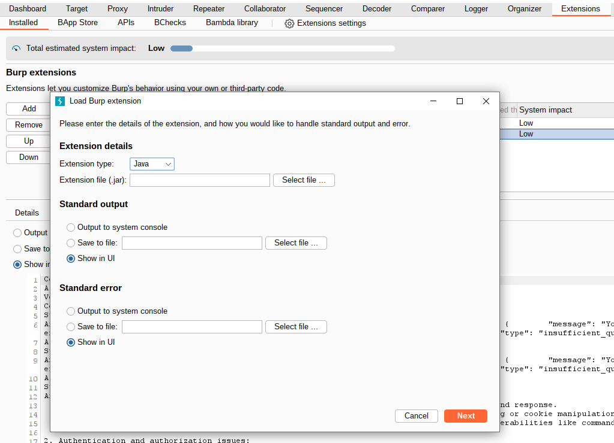
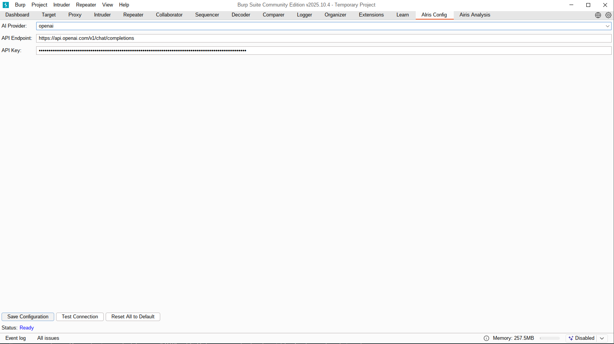
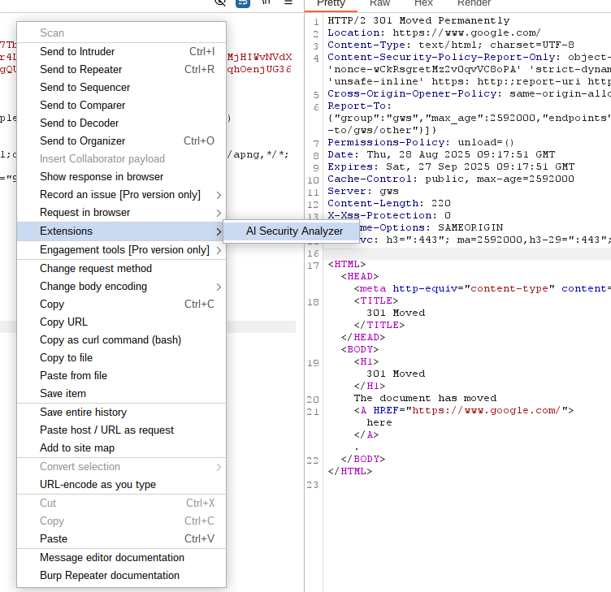
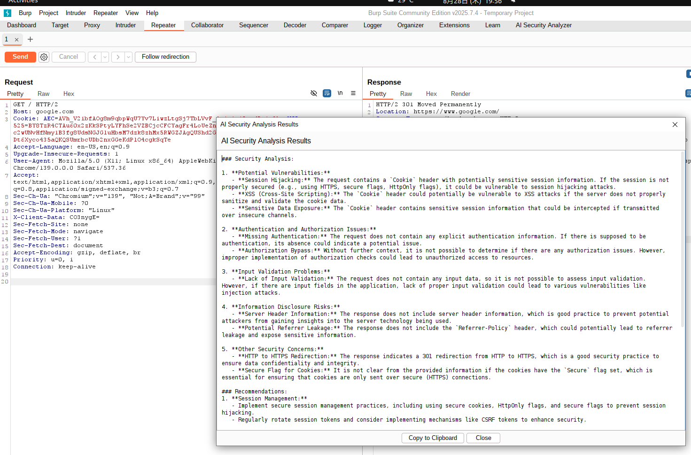

# AIRIS: Artificial Intelligence Request Insight System

## INDEX

- [ABOUT](#about)
- [HOW TO USE](#how-to-use)
- [ENVIRONMENT](#environment)
- [PREPARING](#preparing)

---

## ABOUT

This is an [Burp Suite](https://portswigger.net/burp) extension that allows you to **custom API key and API endpoint**, and send the selected request and response from within Burp Suite as context for analysis by an LLM.

By configuring a system prompt, you can streamline vulnerability assessments.

---

## HOW TO USE

1. Open Burp Suite and add .jar file.
    
2. Add Your OpenAI API Key in the Extension settings.
    
3. Use Extensions
    
4. Result
    

---

## ENVIRONMENT

This project is just Vibe Coding.
I will improve it someday.

---

## PREPARING

---

